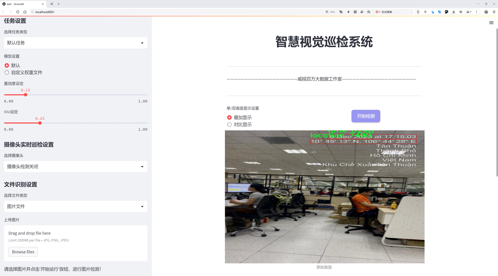
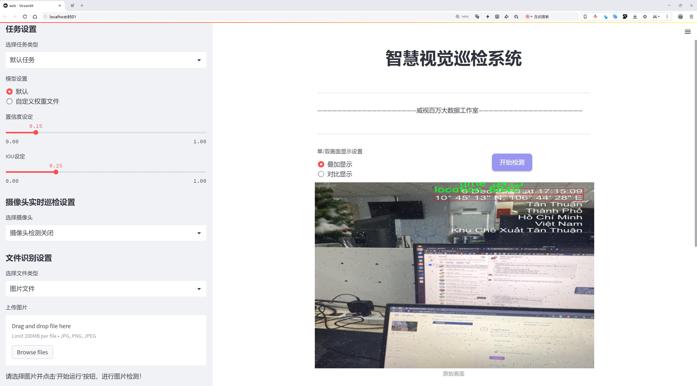
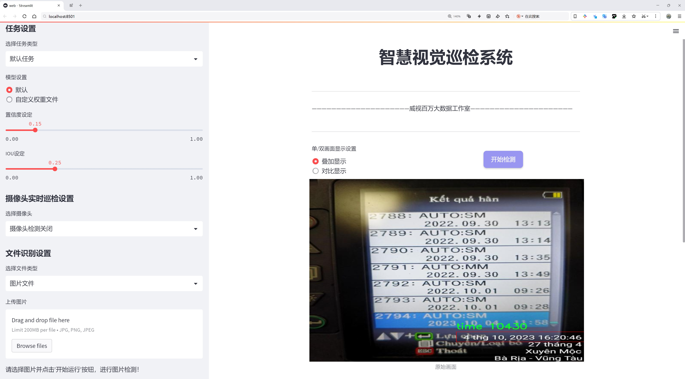
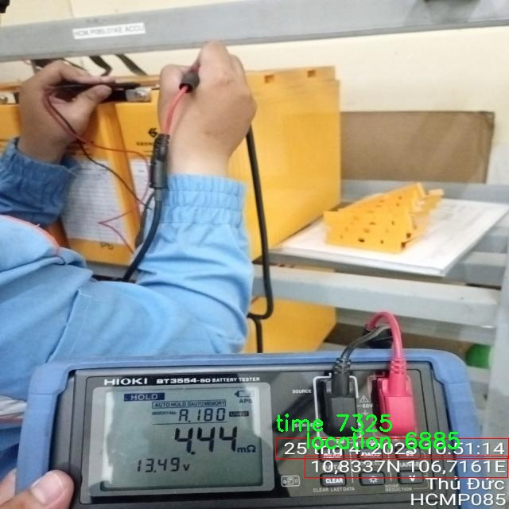
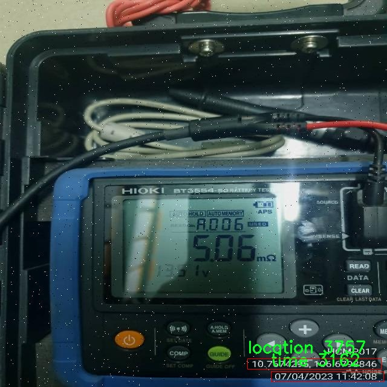
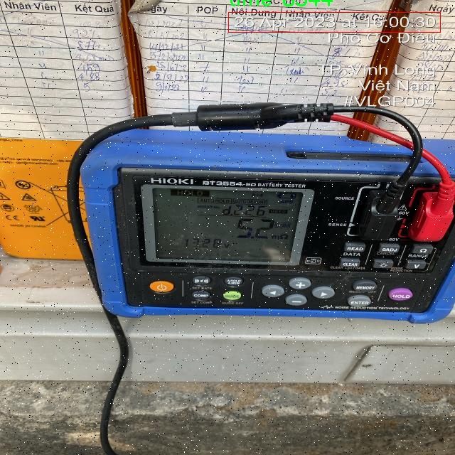
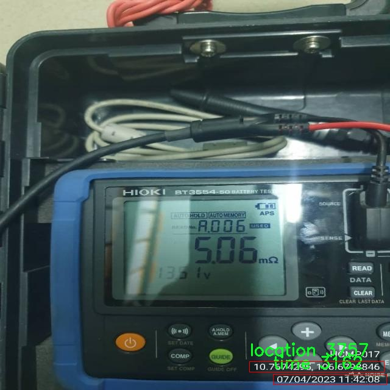
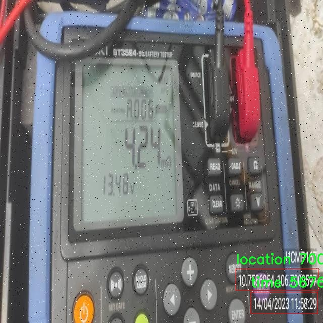

# 设备日期和时间信息检测系统源码分享
 # [一条龙教学YOLOV8标注好的数据集一键训练_70+全套改进创新点发刊_Web前端展示]

### 1.研究背景与意义

项目参考[AAAI Association for the Advancement of Artificial Intelligence](https://gitee.com/qunmasj/projects)

项目来源[AACV Association for the Advancement of Computer Vision](https://kdocs.cn/l/cszuIiCKVNis)

研究背景与意义

随着信息技术的迅猛发展，智能设备的普及使得数据的获取和处理变得更加便捷。在这一背景下，如何高效、准确地提取和识别设备上的日期和时间信息，成为了一个重要的研究课题。传统的手动记录方式不仅效率低下，而且容易出错，尤其是在大规模数据处理的场景中，自动化的信息提取显得尤为重要。因此，基于计算机视觉和深度学习技术的自动检测系统应运而生，能够在各种环境下快速、准确地识别和提取设备的日期和时间信息。

YOLO（You Only Look Once）系列模型因其高效的实时目标检测能力而受到广泛关注。YOLOv8作为该系列的最新版本，进一步提升了检测精度和速度，适用于多种复杂场景。针对设备日期和时间信息的检测，改进YOLOv8模型能够更好地适应不同的设备屏幕和显示格式，进而提高识别的准确性和鲁棒性。通过对模型的优化，研究者可以有效地处理多种类信息，包括位置、屏幕内容、时间等，从而实现对设备信息的全面检测。

本研究所使用的数据集“date_location_detect”包含589张图像，涵盖了5个类别，分别为位置、屏幕内容、时间等。这些数据不仅为模型的训练提供了丰富的样本，也为后续的测试和验证奠定了基础。通过对这些图像的分析，研究者可以深入理解不同设备在显示日期和时间信息时的多样性和复杂性。这一过程不仅有助于提高模型的泛化能力，还能为未来的研究提供重要的参考。

在实际应用中，基于改进YOLOv8的设备日期和时间信息检测系统可以广泛应用于智能家居、物联网、智能交通等领域。例如，在智能家居中，系统能够实时监测设备的状态，并自动记录相关时间信息，帮助用户更好地管理和调度设备。在物联网环境下，系统可以通过自动化的数据采集，提升数据处理的效率和准确性，进而为决策提供有力支持。此外，在智能交通系统中，及时获取和分析交通设备的时间信息，有助于提高交通管理的智能化水平，优化交通流量。

综上所述，基于改进YOLOv8的设备日期和时间信息检测系统的研究，不仅具有重要的理论意义，也具备广泛的实际应用价值。通过深入探索该领域的技术和方法，研究者能够推动智能设备信息处理的自动化进程，为实现更高效的智能生活奠定基础。同时，该研究也为后续相关领域的研究提供了新的思路和方法，具有重要的学术价值和社会意义。

### 2.图片演示







##### 注意：由于此博客编辑较早，上面“2.图片演示”和“3.视频演示”展示的系统图片或者视频可能为老版本，新版本在老版本的基础上升级如下：（实际效果以升级的新版本为准）

  （1）适配了YOLOV8的“目标检测”模型和“实例分割”模型，通过加载相应的权重（.pt）文件即可自适应加载模型。

  （2）支持“图片识别”、“视频识别”、“摄像头实时识别”三种识别模式。

  （3）支持“图片识别”、“视频识别”、“摄像头实时识别”三种识别结果保存导出，解决手动导出（容易卡顿出现爆内存）存在的问题，识别完自动保存结果并导出到tempDir中。

  （4）支持Web前端系统中的标题、背景图等自定义修改，后面提供修改教程。

  另外本项目提供训练的数据集和训练教程,暂不提供权重文件（best.pt）,需要您按照教程进行训练后实现图片演示和Web前端界面演示的效果。

### 3.视频演示

[3.1 视频演示](https://www.bilibili.com/video/BV1sm23YYEnr/)

### 4.数据集信息展示

##### 4.1 本项目数据集详细数据（类别数＆类别名）

nc: 2
names: ['location', 'time']


##### 4.2 本项目数据集信息介绍

数据集信息展示

在本研究中，我们采用了名为“date_location_detect”的数据集，以支持对设备日期和时间信息的检测系统的改进，特别是针对YOLOv8模型的训练与优化。该数据集的设计旨在为计算机视觉任务提供丰富的样本，确保模型能够有效地识别和解析与时间及地点相关的信息。数据集的类别数量为2，具体类别包括“location”（地点）和“time”（时间），这两个类别构成了数据集的核心内容。

“date_location_detect”数据集的构建过程经过精心设计，旨在涵盖多样化的场景和条件，以提高模型的泛化能力和准确性。在“location”类别中，数据集包含了多种地理位置的图像样本，这些样本可能包括城市街道、乡村风景、公共交通站点等多种环境。每个样本都经过标注，确保模型能够学习到不同地点的特征，如建筑物的形状、交通标志、地面标记等。这些信息对于后续的地点识别至关重要，尤其是在复杂的背景和多变的光照条件下，模型需要具备强大的适应能力。

另一方面，“time”类别则专注于时间信息的识别，数据集中包含了多种形式的时间表示，如数字时钟、电子显示屏、手表等。这些样本不仅涵盖了不同的时间格式（如12小时制和24小时制），还包括了各种时间显示的环境，例如室内、室外以及不同的光照条件。通过这样的设计，数据集能够帮助模型学习到时间信息的多样性和复杂性，从而提高其在实际应用中的表现。

在数据集的构建过程中，数据的多样性和代表性是关键因素。为了确保模型能够在各种实际场景中表现出色，数据集的样本来源广泛，涵盖了不同的地理区域、文化背景和时间格式。这种多样性不仅有助于提升模型的准确性，还能增强其在面对未知数据时的鲁棒性。此外，数据集中的样本经过严格的质量控制，确保每个图像都具备清晰的标注信息，以便于模型的训练和评估。

在使用“date_location_detect”数据集进行YOLOv8模型的训练时，我们将采取一系列数据增强技术，以进一步提高模型的性能。这些技术包括图像旋转、缩放、裁剪和颜色调整等，旨在模拟不同的拍摄条件和视角变化。通过这些数据增强手段，我们期望模型能够在面对实际应用时，依然保持高效的识别能力。

总之，“date_location_detect”数据集为改进YOLOv8的设备日期和时间信息检测系统提供了坚实的基础。通过对“location”和“time”两个类别的深入研究与训练，我们相信该模型将能够在实际应用中实现高效、准确的日期和时间信息识别，为相关领域的智能化发展贡献力量。











### 5.全套项目环境部署视频教程（零基础手把手教学）

[5.1 环境部署教程链接（零基础手把手教学）](https://www.ixigua.com/7404473917358506534?logTag=c807d0cbc21c0ef59de5)


[5.2 安装Python虚拟环境创建和依赖库安装视频教程链接（零基础手把手教学）](https://www.ixigua.com/7404474678003106304?logTag=1f1041108cd1f708b01a)

### 6.手把手YOLOV8训练视频教程（零基础小白有手就能学会）

[6.1 手把手YOLOV8训练视频教程（零基础小白有手就能学会）](https://www.ixigua.com/7404477157818401292?logTag=d31a2dfd1983c9668658)


按照上面的训练视频教程链接加载项目提供的数据集，运行train.py即可开始训练



     Epoch   gpu_mem       box       obj       cls    labels  img_size
     1/200     20.8G   0.01576   0.01955  0.007536        22      1280: 100%|██████████| 849/849 [14:42<00:00,  1.04s/it]
               Class     Images     Labels          P          R     mAP@.5 mAP@.5:.95: 100%|██████████| 213/213 [01:14<00:00,  2.87it/s]
                 all       3395      17314      0.994      0.957      0.0957      0.0843

     Epoch   gpu_mem       box       obj       cls    labels  img_size
     2/200     20.8G   0.01578   0.01923  0.007006        22      1280: 100%|██████████| 849/849 [14:44<00:00,  1.04s/it]
               Class     Images     Labels          P          R     mAP@.5 mAP@.5:.95: 100%|██████████| 213/213 [01:12<00:00,  2.95it/s]
                 all       3395      17314      0.996      0.956      0.0957      0.0845

     Epoch   gpu_mem       box       obj       cls    labels  img_size
     3/200     20.8G   0.01561    0.0191  0.006895        27      1280: 100%|██████████| 849/849 [10:56<00:00,  1.29it/s]
               Class     Images     Labels          P          R     mAP@.5 mAP@.5:.95: 100%|███████   | 187/213 [00:52<00:00,  4.04it/s]
                 all       3395      17314      0.996      0.957      0.0957      0.0845


### 7.70+种全套YOLOV8创新点代码加载调参视频教程（一键加载写好的改进模型的配置文件）

[7.1 70+种全套YOLOV8创新点代码加载调参视频教程（一键加载写好的改进模型的配置文件）](https://www.ixigua.com/7404478314661806627?logTag=29066f8288e3f4eea3a4)

### 8.70+种全套YOLOV8创新点原理讲解（非科班也可以轻松写刊发刊，V10版本正在科研待更新）

#### 由于篇幅限制，每个创新点的具体原理讲解就不一一展开，具体见下列网址中的创新点对应子项目的技术原理博客网址【Blog】：


[8.1 70+种全套YOLOV8创新点原理讲解链接](https://gitee.com/qunmasj/good)

#### 部分改进原理讲解(完整的改进原理见上图和技术博客链接)【如果此小节的图加载失败可以通过CSDN或者Github搜索该博客的标题访问原始博客，原始博客图片显示正常】
### CBAM空间注意力机制
近年来，随着深度学习研究方向的火热，注意力机制也被广泛地应用在图像识别、语音识别和自然语言处理等领域，注意力机制在深度学习任务中发挥着举足轻重的作用。注意力机制借鉴于人类的视觉系统，例如，人眼在看到一幅画面时，会倾向于关注画面中的重要信息，而忽略其他可见的信息。深度学习中的注意力机制和人类视觉的注意力机制相似，通过扫描全局数据，从大量数据中选择出需要重点关注的、对当前任务更为重要的信息，然后对这部分信息分配更多的注意力资源，从这些信息中获取更多所需要的细节信息，而抑制其他无用的信息。而在深度学习中，则具体表现为给感兴趣的区域更高的权重，经过网络的学习和调整，得到最优的权重分配，形成网络模型的注意力，使网络拥有更强的学习能力，加快网络的收敛速度。
注意力机制通常可分为软注意力机制和硬注意力机制[4-5]。软注意力机制在选择信息时，不是从输入的信息中只选择1个，而会用到所有输入信息，只是各个信息对应的权重分配不同，然后输入网络模型进行计算;硬注意力机制则是从输入的信息中随机选取一个或者选择概率最高的信息，但是这一步骤通常是不可微的，导致硬注意力机制更难训练。因此，软注意力机制应用更为广泛，按照原理可将软注意力机制划分为:通道注意力机制（channel attention)、空间注意力机制(spatial attention）和混合域注意力机制(mixed attention)。
通道注意力机制的本质建立各个特征通道之间的重要程度，对感兴趣的通道进行重点关注，弱化不感兴趣的通道的作用;空间注意力的本质则是建模了整个空间信息的重要程度，然后对空间内感兴趣的区域进行重点关注，弱化其余非感兴趣区域的作用;混合注意力同时运用了通道注意力和空间注意力，两部分先后进行或并行，形成对通道特征和空间特征同时关注的注意力模型。

卷积层注意力模块(Convolutional Block Attention Module，CBAM）是比较常用的混合注意力模块，其先后集中了通道注意力模块和空间注意力模块，网络中加入该模块能有效提高网络性能，减少网络模型的计算量，模块结构如图所示。输入特征图首先经过分支的通道注意力模块，然后和主干的原特征图融合，得到具有通道注意力的特征图，接着经过分支的空间注意力模块，在和主干的特征图融合后，得到同时具有通道特征注意力和空间特征注意力的特征图。CBAM模块不改变输入特征图的大小，因此该模块是一个“即插即用”的模块，可以插入网络的任何位置。

通道注意力模块的结构示意图如图所示，通道注意力模块分支并行地对输入的特征图进行最大池化操作和平均池化操作，然后利用多层感知机对结果进行变换，得到应用于两个通道的变换结果，最后经过sigmoid激活函数将变换结果融合，得到具有通道注意力的通道特征图。

空间注意力模块示意图如图所示，将通道注意力模块输出的特征图作为该模块的输入特征图，首先对输入特征图进行基于通道的最大池化操作和平均池化操作，将两部分得到的结果拼接起来，然后通过卷积得到降为Ⅰ通道的特征图，最后通过sigmoid激活函数生成具有空间注意力的特征图。


### 9.系统功能展示（检测对象为举例，实际内容以本项目数据集为准）

图9.1.系统支持检测结果表格显示

  图9.2.系统支持置信度和IOU阈值手动调节

  图9.3.系统支持自定义加载权重文件best.pt(需要你通过步骤5中训练获得)

  图9.4.系统支持摄像头实时识别

  图9.5.系统支持图片识别

  图9.6.系统支持视频识别

  图9.7.系统支持识别结果文件自动保存

  图9.8.系统支持Excel导出检测结果数据


### 10.原始YOLOV8算法原理

原始YOLOv8算法原理

YOLOv8算法是目标检测领域的一个重要里程碑，继承并优化了YOLO系列算法的优良传统。作为一种单阶段检测算法，YOLOv8在检测精度和速度上均表现出色，成为了许多实时应用的首选方案。该算法的设计理念是将目标检测任务转化为一个回归问题，通过一个统一的神经网络模型同时预测目标的位置和类别，从而实现高效的目标检测。

YOLOv8的网络结构主要由四个部分组成：输入层、主干网络（Backbone）、特征融合网络（Neck）和检测模块（Head）。在输入层，YOLOv8对输入图像进行预处理，包括图像比例调整、Mosaic增强和瞄点计算等。这些预处理步骤不仅提高了模型的鲁棒性，还为后续的特征提取奠定了基础。

主干网络是YOLOv8的核心部分，依然采用了跨级结构（Cross Stage Partial, CSP）的思想。与之前的YOLO版本相比，YOLOv8对C3模块进行了优化，采用了更轻量的C2f模块。这一改进不仅保留了轻量级特性，还提高了特征提取的效率。通过C2f模块，YOLOv8能够在不同尺度的模型中调整通道数，从而获得更丰富的梯度流动信息，进一步增强了特征提取的能力。此外，YOLOv8保留了空间金字塔池化（SPPF）模块，利用不同内核尺寸的池化对特征图进行合并，以便更好地捕捉多尺度信息。

在特征融合网络部分，YOLOv8采用了双塔结构，结合了特征金字塔网络（FPN）和路径聚合网络（PAN）。这种设计促进了语义特征和定位特征的有效转移，使得网络能够获取更丰富的特征信息，增强了对不同尺度目标的检测性能。特征融合网络的设计旨在最大限度地利用主干网络提取的特征，确保在目标检测过程中能够充分考虑到不同层次的特征信息。

YOLOv8的检测模块采用了解耦头结构，将分类和回归任务分离为两个独立的分支。这一创新使得每个任务能够更加专注于自身的目标，从而解决了复杂场景下定位不准和分类错误的问题。通过解耦，YOLOv8能够更有效地处理目标检测中的各种挑战，尤其是在目标密集或背景复杂的情况下。

值得一提的是，YOLOv8引入了Anchor-free目标检测方法，这一方法基于回归的方式直接预测目标的位置和大小，省去了传统方法中预先定义锚点框的繁琐过程。传统的锚点框方法在处理不同尺度和形状的目标时，往往需要复杂的调整和选择，而YOLOv8的Anchor-free设计使得网络能够更快地聚焦于目标位置的邻近点，从而使得预测框更接近于实际边界框区域。这一创新显著提高了YOLOv8在各种场景下的适应性和准确性。

在损失函数的设计上，YOLOv8采用了新的损失策略，通过变焦损失计算分类损失，并使用数据平均保真度损失和完美交并比损失对边界框损失进行计算。这种损失策略的引入，使得YOLOv8在训练过程中能够更加准确地进行目标检测，尤其是在处理复杂场景和小目标时，表现出更高的精度。

总的来说，YOLOv8算法在继承YOLO系列优点的基础上，通过一系列创新和优化，提升了目标检测的效率和准确性。其轻量化的特征提取网络和高效的特征融合策略，使得YOLOv8能够在实时检测中表现出色，适用于多种实际应用场景。随着技术的不断进步，YOLOv8无疑将在目标检测领域继续发挥重要作用，推动相关研究和应用的发展。


### 11.项目核心源码讲解（再也不用担心看不懂代码逻辑）

#### 11.1 code\ultralytics\models\sam\modules\decoders.py

以下是对代码中最核心部分的提取和详细中文注释：

```python
import torch
from torch import nn
from typing import List, Tuple, Type

class MaskDecoder(nn.Module):
    """
    MaskDecoder类用于生成图像的掩码及其质量评分，使用变换器架构来预测掩码。
    """

    def __init__(
        self,
        *,
        transformer_dim: int,
        transformer: nn.Module,
        num_multimask_outputs: int = 3,
        activation: Type[nn.Module] = nn.GELU,
        iou_head_depth: int = 3,
        iou_head_hidden_dim: int = 256,
    ) -> None:
        """
        初始化MaskDecoder。

        参数:
            transformer_dim (int): 变换器模块的通道维度
            transformer (nn.Module): 用于预测掩码的变换器
            num_multimask_outputs (int): 预测的掩码数量
            activation (nn.Module): 用于上采样掩码的激活函数
            iou_head_depth (int): 用于预测掩码质量的MLP深度
            iou_head_hidden_dim (int): 用于预测掩码质量的MLP隐藏维度
        """
        super().__init__()
        self.transformer_dim = transformer_dim
        self.transformer = transformer
        self.num_multimask_outputs = num_multimask_outputs

        # IoU令牌的嵌入
        self.iou_token = nn.Embedding(1, transformer_dim)
        # 掩码令牌的数量
        self.num_mask_tokens = num_multimask_outputs + 1
        self.mask_tokens = nn.Embedding(self.num_mask_tokens, transformer_dim)

        # 输出上采样网络
        self.output_upscaling = nn.Sequential(
            nn.ConvTranspose2d(transformer_dim, transformer_dim // 4, kernel_size=2, stride=2),
            nn.LayerNorm(transformer_dim // 4),
            activation(),
            nn.ConvTranspose2d(transformer_dim // 4, transformer_dim // 8, kernel_size=2, stride=2),
            activation(),
        )
        
        # 用于生成掩码的超网络MLP
        self.output_hypernetworks_mlps = nn.ModuleList(
            [MLP(transformer_dim, transformer_dim, transformer_dim // 8, 3) for _ in range(self.num_mask_tokens)]
        )

        # 预测掩码质量的MLP
        self.iou_prediction_head = MLP(transformer_dim, iou_head_hidden_dim, self.num_mask_tokens, iou_head_depth)

    def forward(
        self,
        image_embeddings: torch.Tensor,
        image_pe: torch.Tensor,
        sparse_prompt_embeddings: torch.Tensor,
        dense_prompt_embeddings: torch.Tensor,
        multimask_output: bool,
    ) -> Tuple[torch.Tensor, torch.Tensor]:
        """
        根据图像和提示嵌入预测掩码。

        参数:
            image_embeddings (torch.Tensor): 图像编码器的嵌入
            image_pe (torch.Tensor): 图像嵌入的位置信息
            sparse_prompt_embeddings (torch.Tensor): 稀疏提示的嵌入
            dense_prompt_embeddings (torch.Tensor): 密集提示的嵌入
            multimask_output (bool): 是否返回多个掩码

        返回:
            torch.Tensor: 预测的掩码
            torch.Tensor: 掩码质量的预测
        """
        masks, iou_pred = self.predict_masks(
            image_embeddings=image_embeddings,
            image_pe=image_pe,
            sparse_prompt_embeddings=sparse_prompt_embeddings,
            dense_prompt_embeddings=dense_prompt_embeddings,
        )

        # 根据是否需要多个掩码选择输出
        mask_slice = slice(1, None) if multimask_output else slice(0, 1)
        masks = masks[:, mask_slice, :, :]
        iou_pred = iou_pred[:, mask_slice]

        return masks, iou_pred

    def predict_masks(
        self,
        image_embeddings: torch.Tensor,
        image_pe: torch.Tensor,
        sparse_prompt_embeddings: torch.Tensor,
        dense_prompt_embeddings: torch.Tensor,
    ) -> Tuple[torch.Tensor, torch.Tensor]:
        """
        预测掩码。

        参数:
            image_embeddings (torch.Tensor): 图像编码器的嵌入
            image_pe (torch.Tensor): 图像嵌入的位置信息
            sparse_prompt_embeddings (torch.Tensor): 稀疏提示的嵌入
            dense_prompt_embeddings (torch.Tensor): 密集提示的嵌入

        返回:
            torch.Tensor: 预测的掩码
            torch.Tensor: 掩码质量的预测
        """
        # 连接输出令牌
        output_tokens = torch.cat([self.iou_token.weight, self.mask_tokens.weight], dim=0)
        output_tokens = output_tokens.unsqueeze(0).expand(sparse_prompt_embeddings.size(0), -1, -1)
        tokens = torch.cat((output_tokens, sparse_prompt_embeddings), dim=1)

        # 扩展每张图像的数据以适应每个掩码
        src = torch.repeat_interleave(image_embeddings, tokens.shape[0], dim=0)
        src = src + dense_prompt_embeddings
        pos_src = torch.repeat_interleave(image_pe, tokens.shape[0], dim=0)

        # 运行变换器
        hs, src = self.transformer(src, pos_src, tokens)
        iou_token_out = hs[:, 0, :]
        mask_tokens_out = hs[:, 1 : (1 + self.num_mask_tokens), :]

        # 上采样掩码嵌入并使用掩码令牌预测掩码
        src = src.transpose(1, 2).view(src.shape[0], src.shape[1], -1)
        upscaled_embedding = self.output_upscaling(src)
        hyper_in_list: List[torch.Tensor] = [
            self.output_hypernetworks_mlps[i](mask_tokens_out[:, i, :]) for i in range(self.num_mask_tokens)
        ]
        hyper_in = torch.stack(hyper_in_list, dim=1)
        masks = (hyper_in @ upscaled_embedding.view(upscaled_embedding.shape[0], -1)).view(upscaled_embedding.shape[0], -1, upscaled_embedding.shape[2], upscaled_embedding.shape[3])

        # 生成掩码质量预测
        iou_pred = self.iou_prediction_head(iou_token_out)

        return masks, iou_pred


class MLP(nn.Module):
    """
    多层感知器（MLP）模型。
    """

    def __init__(
        self,
        input_dim: int,
        hidden_dim: int,
        output_dim: int,
        num_layers: int,
        sigmoid_output: bool = False,
    ) -> None:
        """
        初始化MLP模型。

        参数:
            input_dim (int): 输入特征的维度
            hidden_dim (int): 隐藏层的维度
            output_dim (int): 输出层的维度
            num_layers (int): 隐藏层的数量
            sigmoid_output (bool): 是否对输出层应用sigmoid激活
        """
        super().__init__()
        self.num_layers = num_layers
        h = [hidden_dim] * (num_layers - 1)
        self.layers = nn.ModuleList(nn.Linear(n, k) for n, k in zip([input_dim] + h, h + [output_dim]))
        self.sigmoid_output = sigmoid_output

    def forward(self, x):
        """执行前向传播并应用激活函数。"""
        for i, layer in enumerate(self.layers):
            x = F.relu(layer(x)) if i < self.num_layers - 1 else layer(x)
        if self.sigmoid_output:
            x = torch.sigmoid(x)
        return x
```

### 代码核心部分说明：
1. **MaskDecoder类**：这是一个用于生成掩码的解码器，使用变换器架构来处理图像和提示嵌入。
2. **__init__方法**：初始化模型的各个组件，包括变换器、掩码令牌、IoU令牌和输出网络。
3. **forward方法**：根据输入的图像和提示嵌入预测掩码，并根据需要选择输出单个或多个掩码。
4. **predict_masks方法**：实际进行掩码预测的逻辑，处理输入数据并通过变换器生成掩码和IoU预测。
5. **MLP类**：定义了一个多层感知器，用于处理特征的前向传播。

以上代码及注释展示了MaskDecoder的核心功能和结构，便于理解其工作原理。

这个文件定义了一个名为 `MaskDecoder` 的类，它是一个用于生成图像掩码及其质量评分的解码器模块，采用了变换器（Transformer）架构。该模块的主要功能是根据图像和提示嵌入（prompt embeddings）来预测掩码。

在 `MaskDecoder` 类的构造函数中，初始化了一些重要的属性，包括变换器的维度、变换器模块本身、要预测的掩码数量、IoU（Intersection over Union）令牌的嵌入、掩码令牌的嵌入以及输出上采样的神经网络序列等。构造函数还定义了一个多层感知机（MLP）用于预测掩码质量。

`forward` 方法是该类的前向传播函数，它接收图像嵌入、图像位置编码、稀疏提示嵌入、密集提示嵌入和一个布尔值（指示是否返回多个掩码）。该方法首先调用 `predict_masks` 方法来生成掩码和IoU预测，然后根据 `multimask_output` 的值选择输出的掩码和IoU预测。

`predict_masks` 方法则负责具体的掩码预测过程。它首先将IoU令牌和掩码令牌的权重连接起来，并扩展为与稀疏提示嵌入相同的批量大小。接着，将图像嵌入和密集提示嵌入进行处理，并将其输入到变换器中。变换器的输出用于生成掩码的嵌入，并通过上采样和MLP进行处理，最终生成掩码和IoU预测。

此外，文件中还定义了一个 `MLP` 类，它是一个轻量级的多层感知机模型，适用于掩码质量预测。该类的构造函数接受输入维度、隐藏层维度、输出维度和层数等参数，并在前向传播中应用ReLU激活函数（除了最后一层），最后可以选择性地对输出应用Sigmoid激活。

总体来说，这个文件实现了一个复杂的掩码解码器，结合了变换器架构和多层感知机，用于高效地生成图像掩码及其质量评分，适用于计算机视觉任务中的图像分割等应用。

#### 11.2 code\ultralytics\solutions\ai_gym.py

以下是代码中最核心的部分，并附上详细的中文注释：

```python
import cv2
from ultralytics.utils.checks import check_imshow
from ultralytics.utils.plotting import Annotator

class AIGym:
    """用于管理基于姿势的实时视频流中的健身步骤的类。"""

    def __init__(self):
        """初始化 AIGym，设置视觉和图像参数的默认值。"""
        self.im0 = None  # 当前帧图像
        self.tf = None   # 线条厚度

        # 关键点和计数信息
        self.keypoints = None  # 姿势关键点
        self.poseup_angle = None  # 上升姿势的角度
        self.posedown_angle = None  # 下降姿势的角度
        self.threshold = 0.001  # 阈值

        # 存储阶段、计数和角度信息
        self.angle = None  # 姿势角度
        self.count = None  # 动作计数
        self.stage = None  # 当前阶段
        self.pose_type = "pushup"  # 姿势类型，默认为俯卧撑
        self.kpts_to_check = None  # 用于计数的关键点

        # 视觉信息
        self.view_img = False  # 是否显示图像
        self.annotator = None  # 注释器实例

        # 检查环境是否支持 imshow
        self.env_check = check_imshow(warn=True)

    def set_args(self, kpts_to_check, line_thickness=2, view_img=False, pose_up_angle=145.0, pose_down_angle=90.0, pose_type="pullup"):
        """
        配置 AIGym 的参数，包括线条厚度、保存图像和显示图像的参数。
        Args:
            kpts_to_check (list): 用于计数的 3 个关键点
            line_thickness (int): 边界框的线条厚度
            view_img (bool): 是否显示图像
            pose_up_angle (float): 设置上升姿势的角度
            pose_down_angle (float): 设置下降姿势的角度
            pose_type: "pushup", "pullup" 或 "abworkout"
        """
        self.kpts_to_check = kpts_to_check  # 设置需要检查的关键点
        self.tf = line_thickness  # 设置线条厚度
        self.view_img = view_img  # 设置是否显示图像
        self.poseup_angle = pose_up_angle  # 设置上升姿势的角度
        self.posedown_angle = pose_down_angle  # 设置下降姿势的角度
        self.pose_type = pose_type  # 设置姿势类型

    def start_counting(self, im0, results, frame_count):
        """
        用于计数健身步骤的函数。
        Args:
            im0 (ndarray): 来自视频流的当前帧
            results: 姿势估计数据
            frame_count: 当前帧计数
        """
        self.im0 = im0  # 保存当前帧图像
        if frame_count == 1:
            # 初始化计数、角度和阶段
            self.count = [0] * len(results[0])
            self.angle = [0] * len(results[0])
            self.stage = ["-" for _ in results[0]]
        
        self.keypoints = results[0].keypoints.data  # 获取关键点数据
        self.annotator = Annotator(im0, line_width=2)  # 创建注释器实例

        num_keypoints = len(results[0])  # 关键点数量

        # 如果关键点数量发生变化，调整角度、计数和阶段的长度
        if len(self.angle) != num_keypoints:
            self.angle = [0] * num_keypoints
            self.count = [0] * num_keypoints
            self.stage = ["-" for _ in range(num_keypoints)]

        # 遍历每个关键点，进行姿势角度估计和计数
        for ind, k in enumerate(reversed(self.keypoints)):
            # 根据姿势类型进行不同的处理
            if self.pose_type in ["pushup", "pullup"]:
                self.angle[ind] = self.annotator.estimate_pose_angle(
                    k[int(self.kpts_to_check[0])].cpu(),
                    k[int(self.kpts_to_check[1])].cpu(),
                    k[int(self.kpts_to_check[2])].cpu(),
                )
                self.im0 = self.annotator.draw_specific_points(k, self.kpts_to_check, shape=(640, 640), radius=10)

            # 处理腹部锻炼的姿势
            if self.pose_type == "abworkout":
                self.angle[ind] = self.annotator.estimate_pose_angle(
                    k[int(self.kpts_to_check[0])].cpu(),
                    k[int(self.kpts_to_check[1])].cpu(),
                    k[int(self.kpts_to_check[2])].cpu(),
                )
                self.im0 = self.annotator.draw_specific_points(k, self.kpts_to_check, shape=(640, 640), radius=10)
                if self.angle[ind] > self.poseup_angle:
                    self.stage[ind] = "down"
                if self.angle[ind] < self.posedown_angle and self.stage[ind] == "down":
                    self.stage[ind] = "up"
                    self.count[ind] += 1
                self.annotator.plot_angle_and_count_and_stage(
                    angle_text=self.angle[ind],
                    count_text=self.count[ind],
                    stage_text=self.stage[ind],
                    center_kpt=k[int(self.kpts_to_check[1])],
                    line_thickness=self.tf,
                )

            # 处理俯卧撑的姿势
            if self.pose_type == "pushup":
                if self.angle[ind] > self.poseup_angle:
                    self.stage[ind] = "up"
                if self.angle[ind] < self.posedown_angle and self.stage[ind] == "up":
                    self.stage[ind] = "down"
                    self.count[ind] += 1
                self.annotator.plot_angle_and_count_and_stage(
                    angle_text=self.angle[ind],
                    count_text=self.count[ind],
                    stage_text=self.stage[ind],
                    center_kpt=k[int(self.kpts_to_check[1])],
                    line_thickness=self.tf,
                )

            # 处理引体向上的姿势
            if self.pose_type == "pullup":
                if self.angle[ind] > self.poseup_angle:
                    self.stage[ind] = "down"
                if self.angle[ind] < self.posedown_angle and self.stage[ind] == "down":
                    self.stage[ind] = "up"
                    self.count[ind] += 1
                self.annotator.plot_angle_and_count_and_stage(
                    angle_text=self.angle[ind],
                    count_text=self.count[ind],
                    stage_text=self.stage[ind],
                    center_kpt=k[int(self.kpts_to_check[1])],
                    line_thickness=self.tf,
                )

            self.annotator.kpts(k, shape=(640, 640), radius=1, kpt_line=True)  # 绘制关键点

        # 如果环境支持并且需要显示图像，则显示当前帧
        if self.env_check and self.view_img:
            cv2.imshow("Ultralytics YOLOv8 AI GYM", self.im0)
            if cv2.waitKey(1) & 0xFF == ord("q"):
                return  # 按 'q' 键退出

        return self.im0  # 返回处理后的图像

if __name__ == "__main__":
    AIGym()  # 创建 AIGym 实例
```

### 代码核心部分说明：
1. **类的初始化**：设置了图像、线条厚度、关键点、姿势角度、计数、阶段等属性，准备进行姿势识别和计数。
2. **设置参数**：`set_args` 方法用于配置需要检查的关键点、线条厚度、显示图像的选项以及姿势的上下角度。
3. **计数逻辑**：`start_counting` 方法中实现了根据关键点计算姿势角度，并根据不同的姿势类型（俯卧撑、引体向上、腹部锻炼）进行计数和阶段判断。
4. **图像显示**：在满足条件时，使用 OpenCV 显示当前处理的图像，并允许用户通过按 'q' 键退出。

这个程序文件定义了一个名为 `AIGym` 的类，旨在通过实时视频流中的姿势识别来管理健身动作的计数。程序首先导入了 `cv2` 库，用于图像处理，并从 `ultralytics.utils` 中导入了一些工具函数。

在 `AIGym` 类的构造函数 `__init__` 中，初始化了一些用于图像处理和姿势识别的默认参数，包括图像、线条厚度、关键点、角度、计数和阶段等信息。它还定义了一个 `pose_type` 属性，用于指示当前的锻炼类型（如俯卧撑、引体向上或腹部锻炼），并通过 `check_imshow` 函数检查当前环境是否支持图像显示。

`set_args` 方法用于配置 `AIGym` 的参数，包括需要检查的关键点、线条厚度、是否显示图像、上升和下降姿势的角度阈值以及锻炼类型。这个方法接受多个参数，允许用户自定义设置。

`start_counting` 方法是核心功能，用于在每一帧中进行健身动作的计数。它接收当前帧图像、姿势估计结果和帧计数作为输入。在第一次调用时，初始化计数、角度和阶段信息。然后，提取关键点数据并创建一个 `Annotator` 对象，用于在图像上绘制信息。

接下来，程序会根据锻炼类型（俯卧撑、引体向上或腹部锻炼）计算每个关键点的角度，并根据设定的角度阈值更新动作的阶段和计数。通过 `Annotator` 对象，程序绘制关键点、角度、计数和阶段信息，并在图像上进行可视化。

最后，如果环境支持图像显示且设置为显示图像，程序会使用 OpenCV 显示当前帧，并在按下 'q' 键时退出。整个方法返回处理后的图像。

在文件的最后部分，程序通过 `if __name__ == "__main__":` 语句来实例化 `AIGym` 类，表明这个文件可以作为脚本直接运行。

#### 11.3 ui.py

```python
import sys
import subprocess

def run_script(script_path):
    """
    使用当前 Python 环境运行指定的脚本。

    Args:
        script_path (str): 要运行的脚本路径

    Returns:
        None
    """
    # 获取当前 Python 解释器的路径
    python_path = sys.executable

    # 构建运行命令
    command = f'"{python_path}" -m streamlit run "{script_path}"'

    # 执行命令
    result = subprocess.run(command, shell=True)
    if result.returncode != 0:
        print("脚本运行出错。")


# 实例化并运行应用
if __name__ == "__main__":
    # 指定您的脚本路径
    script_path = "web.py"  # 这里直接指定脚本路径

    # 运行脚本
    run_script(script_path)
```

### 代码注释说明：

1. **导入模块**：
   - `import sys`：导入系统相关的模块，用于获取当前 Python 解释器的路径。
   - `import subprocess`：导入子进程模块，用于在 Python 中执行外部命令。

2. **定义函数 `run_script`**：
   - 函数接受一个参数 `script_path`，表示要运行的 Python 脚本的路径。
   - 使用 `sys.executable` 获取当前 Python 解释器的完整路径，以确保使用正确的 Python 环境运行脚本。
   - 构建一个命令字符串 `command`，该命令将使用 `streamlit` 模块运行指定的脚本。
   - 使用 `subprocess.run` 执行构建的命令。如果命令执行返回的状态码不为 0，表示脚本运行出错，打印错误信息。

3. **主程序入口**：
   - 使用 `if __name__ == "__main__":` 确保只有在直接运行该脚本时才会执行以下代码。
   - 指定要运行的脚本路径 `script_path`，这里直接赋值为 `"web.py"`。
   - 调用 `run_script` 函数，传入脚本路径以运行该脚本。

这个程序文件名为 `ui.py`，主要功能是通过当前的 Python 环境运行一个指定的脚本，具体是一个名为 `web.py` 的文件。程序首先导入了必要的模块，包括 `sys`、`os` 和 `subprocess`，这些模块分别用于访问系统特性、处理文件路径和执行外部命令。

在 `run_script` 函数中，程序接受一个参数 `script_path`，这个参数是要运行的脚本的路径。函数内部首先获取当前 Python 解释器的路径，存储在 `python_path` 变量中。接着，程序构建了一个命令字符串，该命令用于通过 `streamlit` 模块运行指定的脚本。这里使用了 `-m` 选项来指定模块运行方式，并将脚本路径包含在命令中。

然后，程序使用 `subprocess.run` 方法执行构建好的命令，`shell=True` 参数允许在 shell 中执行命令。执行后，程序检查返回的结果码，如果结果码不为零，表示脚本运行出错，程序会输出一条错误信息。

在文件的最后部分，程序通过 `if __name__ == "__main__":` 判断是否是直接运行该脚本。如果是，程序会调用 `abs_path` 函数获取 `web.py` 的绝对路径，并将其传递给 `run_script` 函数以执行该脚本。整体来看，这个程序的设计目的是为了方便地在一个 Python 环境中启动和运行一个 Streamlit 应用。

#### 11.4 70+种YOLOv8算法改进源码大全和调试加载训练教程（非必要）\ultralytics\utils\metrics.py

以下是代码中最核心的部分，并附上详细的中文注释：

```python
import numpy as np
import torch

def box_iou(box1, box2, eps=1e-7):
    """
    计算两个边界框的交并比（IoU）。
    
    参数：
        box1 (torch.Tensor): 形状为 (N, 4) 的张量，表示 N 个边界框。
        box2 (torch.Tensor): 形状为 (M, 4) 的张量，表示 M 个边界框。
        eps (float, optional): 避免除以零的小值。默认值为 1e-7。

    返回：
        (torch.Tensor): 形状为 (N, M) 的张量，包含 box1 和 box2 中每对边界框的 IoU 值。
    """
    # 将 box1 和 box2 的坐标分解为 x1, y1, x2, y2
    (a1, a2), (b1, b2) = box1.unsqueeze(1).chunk(2, 2), box2.unsqueeze(0).chunk(2, 2)
    
    # 计算交集区域
    inter = (torch.min(a2, b2) - torch.max(a1, b1)).clamp_(0).prod(2)

    # 计算 IoU = 交集 / (区域1 + 区域2 - 交集)
    return inter / ((a2 - a1).prod(2) + (b2 - b1).prod(2) - inter + eps)

def bbox_iou(box1, box2, xywh=True, eps=1e-7):
    """
    计算边界框的交并比（IoU）。
    
    参数：
        box1 (torch.Tensor): 形状为 (1, 4) 的张量，表示单个边界框。
        box2 (torch.Tensor): 形状为 (n, 4) 的张量，表示 n 个边界框。
        xywh (bool, optional): 如果为 True，输入框为 (x, y, w, h) 格式；如果为 False，输入框为 (x1, y1, x2, y2) 格式。默认值为 True。
        eps (float, optional): 避免除以零的小值。默认值为 1e-7。

    返回：
        (torch.Tensor): IoU 值。
    """
    # 将边界框从 (x, y, w, h) 转换为 (x1, y1, x2, y2) 格式
    if xywh:
        (x1, y1, w1, h1), (x2, y2, w2, h2) = box1.chunk(4, -1), box2.chunk(4, -1)
        b1_x1, b1_x2, b1_y1, b1_y2 = x1 - w1 / 2, x1 + w1 / 2, y1 - h1 / 2, y1 + h1 / 2
        b2_x1, b2_x2, b2_y1, b2_y2 = x2 - w2 / 2, x2 + w2 / 2, y2 - h2 / 2, y2 + h2 / 2
    else:
        b1_x1, b1_y1, b1_x2, b1_y2 = box1.chunk(4, -1)
        b2_x1, b2_y1, b2_x2, b2_y2 = box2.chunk(4, -1)

    # 计算交集区域
    inter = (b1_x2.minimum(b2_x2) - b1_x1.maximum(b2_x1)).clamp_(0) * \
            (b1_y2.minimum(b2_y2) - b1_y1.maximum(b2_y1)).clamp_(0)

    # 计算联合区域
    union = (b1_x2 - b1_x1) * (b1_y2 - b1_y1 + eps) + (b2_x2 - b2_x1) * (b2_y2 - b2_y1 + eps) - inter + eps

    # 返回 IoU 值
    return inter / union

def mask_iou(mask1, mask2, eps=1e-7):
    """
    计算两个掩膜的交并比（IoU）。
    
    参数：
        mask1 (torch.Tensor): 形状为 (N, n) 的张量，N 是真实对象的数量，n 是图像宽度和高度的乘积。
        mask2 (torch.Tensor): 形状为 (M, n) 的张量，M 是预测对象的数量，n 是图像宽度和高度的乘积。
        eps (float, optional): 避免除以零的小值。默认值为 1e-7。

    返回：
        (torch.Tensor): 形状为 (N, M) 的张量，表示掩膜的 IoU。
    """
    # 计算交集
    intersection = torch.matmul(mask1, mask2.T).clamp_(0)
    
    # 计算联合区域
    union = (mask1.sum(1)[:, None] + mask2.sum(1)[None]) - intersection  # (area1 + area2) - intersection
    
    # 返回 IoU 值
    return intersection / (union + eps)
```

### 代码核心部分解释：
1. **box_iou**: 计算两个边界框的交并比（IoU），用于评估检测结果的重叠程度。
2. **bbox_iou**: 计算单个边界框与多个边界框的 IoU，支持两种输入格式（xywh 和 xyxy）。
3. **mask_iou**: 计算两个二进制掩膜的 IoU，适用于实例分割任务。

这些函数是目标检测和实例分割任务中评估模型性能的基础，常用于计算检测框的重叠程度，从而评估模型的准确性。

这个程序文件是YOLOv8算法中用于模型验证和评估指标的实现。它包含了多个函数和类，用于计算目标检测、分类、分割等任务的性能指标。

首先，文件导入了一些必要的库，如数学库、警告处理、路径处理、绘图库、NumPy和PyTorch等。接着，定义了一些常量和函数，主要用于计算不同类型的交并比（IoU）和其他评估指标。

文件中定义的函数包括：
- `bbox_ioa`：计算两个边界框之间的交集与box2的面积比。
- `box_iou`：计算两个边界框之间的标准IoU。
- `bbox_iou`：计算单个边界框与多个边界框之间的IoU，并支持多种IoU计算方式（如GIoU、DIoU等）。
- `get_inner_iou`和`bbox_inner_iou`：计算边界框的内部IoU。
- `wasserstein_loss`：实现了一种基于Wasserstein距离的损失函数，用于优化边界框的预测。
- `mask_iou`：计算分割掩膜的IoU。
- `kpt_iou`：计算关键点相似性（OKS）。
- `smooth_BCE`：计算平滑的二元交叉熵目标。

此外，文件中还定义了多个类，用于管理和计算评估指标：
- `ConfusionMatrix`：用于计算和更新混淆矩阵，支持目标检测和分类任务。
- `Metric`：用于计算YOLOv8模型的评估指标，包括精度、召回率和平均精度（mAP）。
- `DetMetrics`：用于计算目标检测的评估指标。
- `SegmentMetrics`：用于计算分割任务的评估指标。
- `PoseMetrics`：用于计算姿态估计的评估指标。
- `ClassifyMetrics`：用于计算分类任务的评估指标，包括top-1和top-5准确率。

每个类都包含了用于处理和更新指标的方法，能够根据预测结果和真实标签计算相应的性能指标。通过这些函数和类，用户可以方便地评估YOLOv8模型在不同任务上的表现，并可视化相关的评估结果。整体上，这个文件为YOLOv8模型的验证和性能评估提供了强大的支持。

#### 11.5 train.py

以下是经过简化和注释的核心代码部分：

```python
import random
import numpy as np
import torch.nn as nn
from ultralytics.data import build_dataloader, build_yolo_dataset
from ultralytics.engine.trainer import BaseTrainer
from ultralytics.models import yolo
from ultralytics.nn.tasks import DetectionModel
from ultralytics.utils import LOGGER, RANK
from ultralytics.utils.torch_utils import de_parallel, torch_distributed_zero_first

class DetectionTrainer(BaseTrainer):
    """
    DetectionTrainer类，继承自BaseTrainer，用于基于检测模型的训练。
    """

    def build_dataset(self, img_path, mode="train", batch=None):
        """
        构建YOLO数据集。

        参数:
            img_path (str): 包含图像的文件夹路径。
            mode (str): 模式，可以是'train'或'val'，用户可以为每种模式自定义不同的增强。
            batch (int, optional): 批次大小，仅用于'rect'模式。默认为None。
        """
        gs = max(int(de_parallel(self.model).stride.max() if self.model else 0), 32)  # 获取模型的最大步幅
        return build_yolo_dataset(self.args, img_path, batch, self.data, mode=mode, rect=mode == "val", stride=gs)

    def get_dataloader(self, dataset_path, batch_size=16, rank=0, mode="train"):
        """构造并返回数据加载器。"""
        assert mode in ["train", "val"]  # 确保模式有效
        with torch_distributed_zero_first(rank):  # 仅在DDP中初始化数据集*.cache一次
            dataset = self.build_dataset(dataset_path, mode, batch_size)  # 构建数据集
        shuffle = mode == "train"  # 训练模式下打乱数据
        workers = self.args.workers if mode == "train" else self.args.workers * 2  # 设置工作线程数
        return build_dataloader(dataset, batch_size, workers, shuffle, rank)  # 返回数据加载器

    def preprocess_batch(self, batch):
        """对图像批次进行预处理，包括缩放和转换为浮点数。"""
        batch["img"] = batch["img"].to(self.device, non_blocking=True).float() / 255  # 将图像转换为浮点数并归一化
        if self.args.multi_scale:  # 如果启用多尺度
            imgs = batch["img"]
            sz = (
                random.randrange(self.args.imgsz * 0.5, self.args.imgsz * 1.5 + self.stride)
                // self.stride
                * self.stride
            )  # 随机选择新的图像大小
            sf = sz / max(imgs.shape[2:])  # 计算缩放因子
            if sf != 1:  # 如果需要缩放
                ns = [
                    math.ceil(x * sf / self.stride) * self.stride for x in imgs.shape[2:]
                ]  # 计算新的形状
                imgs = nn.functional.interpolate(imgs, size=ns, mode="bilinear", align_corners=False)  # 进行插值缩放
            batch["img"] = imgs  # 更新批次图像
        return batch

    def get_model(self, cfg=None, weights=None, verbose=True):
        """返回YOLO检测模型。"""
        model = DetectionModel(cfg, nc=self.data["nc"], verbose=verbose and RANK == -1)  # 创建检测模型
        if weights:
            model.load(weights)  # 加载权重
        return model

    def plot_training_samples(self, batch, ni):
        """绘制带有注释的训练样本。"""
        plot_images(
            images=batch["img"],
            batch_idx=batch["batch_idx"],
            cls=batch["cls"].squeeze(-1),
            bboxes=batch["bboxes"],
            paths=batch["im_file"],
            fname=self.save_dir / f"train_batch{ni}.jpg",
            on_plot=self.on_plot,
        )

    def plot_metrics(self):
        """从CSV文件中绘制指标。"""
        plot_results(file=self.csv, on_plot=self.on_plot)  # 保存结果图
```

### 代码注释说明：
1. **DetectionTrainer类**：用于训练YOLO检测模型的类，继承自基础训练类`BaseTrainer`。
2. **build_dataset方法**：构建YOLO数据集，支持训练和验证模式。
3. **get_dataloader方法**：构造数据加载器，确保在分布式训练中只初始化一次数据集。
4. **preprocess_batch方法**：对输入的图像批次进行预处理，包括归一化和多尺度调整。
5. **get_model方法**：返回YOLO检测模型，并可选择加载预训练权重。
6. **plot_training_samples方法**：绘制训练样本及其注释，便于可视化训练过程。
7. **plot_metrics方法**：从CSV文件中绘制训练指标，帮助分析模型性能。

这个程序文件 `train.py` 是一个用于训练 YOLO（You Only Look Once）目标检测模型的 Python 脚本，主要包含了数据集构建、数据加载、模型训练等功能。它继承自 `BaseTrainer` 类，提供了一些特定于目标检测的功能。

首先，程序导入了一些必要的库和模块，包括数学运算、随机数生成、深度学习相关的 PyTorch 库，以及 Ultralytics 提供的用于数据处理和模型训练的工具。接着，定义了一个 `DetectionTrainer` 类，该类用于训练基于 YOLO 的检测模型。

在 `DetectionTrainer` 类中，`build_dataset` 方法用于构建 YOLO 数据集。它接收图像路径、模式（训练或验证）和批量大小作为参数，并调用 `build_yolo_dataset` 函数来生成数据集。这里还计算了模型的步幅，以确保数据集的构建符合模型的要求。

`get_dataloader` 方法用于创建数据加载器。它根据传入的模式（训练或验证）构建数据集，并返回一个数据加载器。此方法中还处理了数据加载的并行性，确保在分布式训练时只初始化一次数据集。

`preprocess_batch` 方法用于对图像批次进行预处理，包括将图像缩放到适当的大小并转换为浮点数。该方法还支持多尺度训练，通过随机选择图像大小来增强模型的鲁棒性。

`set_model_attributes` 方法用于设置模型的属性，包括类别数量和类别名称。这些信息会被附加到模型中，以便在训练过程中使用。

`get_model` 方法返回一个 YOLO 检测模型，并可以选择加载预训练权重。`get_validator` 方法则返回一个用于模型验证的 `DetectionValidator` 实例。

`label_loss_items` 方法用于返回带有标签的训练损失项字典，这在目标检测中是必要的。`progress_string` 方法生成一个格式化的字符串，用于显示训练进度，包括当前的 epoch、GPU 内存使用情况、损失值等信息。

`plot_training_samples` 方法用于绘制训练样本及其标注，帮助可视化训练过程中的数据。`plot_metrics` 和 `plot_training_labels` 方法则用于绘制训练过程中的指标和标签，分别从 CSV 文件和数据集中提取信息进行可视化。

总的来说，这个文件提供了一个完整的框架，用于训练 YOLO 目标检测模型，涵盖了数据处理、模型构建、训练过程监控和结果可视化等多个方面。

#### 11.6 70+种YOLOv8算法改进源码大全和调试加载训练教程（非必要）\ultralytics\nn\extra_modules\ops_dcnv3\modules\__init__.py

以下是保留的核心代码部分，并附上详细的中文注释：

```python
# 导入DCNv3相关模块
from .dcnv3 import DCNv3, DCNv3_pytorch, DCNv3_DyHead

# 说明：
# 1. 从当前包（.）中导入dcnv3模块。
# 2. DCNv3：可能是一个深度可分离卷积的实现，用于提高卷积神经网络的性能。
# 3. DCNv3_pytorch：可能是DCNv3在PyTorch框架下的实现，便于在PyTorch中使用。
# 4. DCNv3_DyHead：可能是一个动态头部（Dynamic Head）模块，通常用于目标检测或分割任务。
```

在这个代码片段中，主要的功能是导入不同的深度学习模块，以便在后续的代码中使用这些模块来构建和训练模型。

这个程序文件是一个Python模块的初始化文件，文件名为`__init__.py`，它位于`ultralytics\nn\extra_modules\ops_dcnv3\modules`目录下。该文件的主要作用是导入其他模块或类，以便在包被导入时能够方便地访问这些功能。

文件开头的注释部分包含了版权信息，说明该代码属于OpenGVLab，并且受MIT许可证的保护。这意味着用户可以自由使用、修改和分发该代码，只要遵循MIT许可证的条款。

在文件的主体部分，使用了`from`语句导入了三个类或模块：`DCNv3`、`DCNv3_pytorch`和`DCNv3_DyHead`。这些类或模块可能与深度学习中的动态卷积（Dynamic Convolution）相关，特别是在YOLOv8算法的实现中。这种动态卷积技术可以提高模型的灵活性和性能，尤其是在处理不同形状和大小的输入时。

通过将这些模块导入到`__init__.py`中，用户在导入整个`ops_dcnv3`包时，可以直接使用这些类，而无需单独导入每一个模块。这种设计提高了代码的可读性和使用的便利性。

总的来说，这个文件的主要功能是组织和管理与动态卷积相关的模块，使得在使用YOLOv8算法时能够更方便地调用这些功能。

### 12.系统整体结构（节选）

### 整体功能和构架概括

该程序整体是一个用于目标检测和计算机视觉任务的框架，主要基于YOLOv8算法。它的功能涵盖了模型的训练、评估、推理以及一些辅助工具和模块。程序的结构清晰，模块化设计使得各个功能之间相对独立，便于维护和扩展。

- **模型训练**：通过 `train.py` 文件实现，负责数据集的构建、数据加载、模型训练和可视化。
- **模型评估**：通过 `metrics.py` 文件提供多种评估指标的计算，包括IoU、精度、召回率等。
- **模型推理**：通过 `predictor.py` 文件实现，负责加载训练好的模型并进行推理。
- **用户界面**：通过 `ui.py` 文件提供了一个简单的界面来运行相关脚本。
- **特定模块**：如 `decoders.py` 和 `encoders.py` 文件实现了特定的模型解码和编码功能，支持更复杂的任务如图像分割。
- **动态卷积模块**：通过 `__init__.py` 文件组织了与动态卷积相关的模块，增强了模型的灵活性。

### 文件功能整理表

| 文件路径                                                                 | 功能描述                                                     |
|------------------------------------------------------------------------|----------------------------------------------------------|
| `code\ultralytics\models\sam\modules\decoders.py`                     | 实现了掩码解码器，生成图像掩码及其质量评分。                     |
| `code\ultralytics\solutions\ai_gym.py`                                | 通过姿势识别管理健身动作计数，处理实时视频流。                     |
| `ui.py`                                                                | 提供用户界面，运行指定的脚本（如 `web.py`）。                   |
| `70+种YOLOv8算法改进源码大全和调试加载训练教程（非必要）\ultralytics\utils\metrics.py` | 计算目标检测、分类和分割任务的评估指标。                           |
| `train.py`                                                            | 负责训练YOLO模型，包括数据集构建、数据加载和训练过程监控。         |
| `70+种YOLOv8算法改进源码大全和调试加载训练教程（非必要）\ultralytics\nn\extra_modules\ops_dcnv3\modules\__init__.py` | 导入动态卷积相关模块，便于在目标检测中使用。                        |
| `70+种YOLOv8算法改进源码大全和调试加载训练教程（非必要）\ultralytics\models\nas\val.py` | 进行模型验证，评估模型在验证集上的性能。                           |
| `70+种YOLOv8算法改进源码大全和调试加载训练教程（非必要）\ultralytics\engine\predictor.py` | 加载训练好的模型并进行推理，输出预测结果。                          |
| `70+种YOLOv8算法改进源码大全和调试加载训练教程（非必要）\ultralytics\models\utils\ops.py` | 提供各种操作的工具函数，支持模型的实现和优化。                      |
| `code\ultralytics\models\sam\modules\encoders.py`                     | 实现了图像编码器，用于特征提取和输入处理。                          |
| `code\ultralytics\utils\__init__.py`                                  | 初始化工具模块，组织和导入相关工具函数。                          |
| `70+种YOLOv8算法改进源码大全和调试加载训练教程（非必要）\ultralytics\utils\triton.py` | 与Triton推理服务器集成，支持模型的在线推理。                       |
| `70+种YOLOv8算法改进源码大全和调试加载训练教程（非必要）\ultralytics\__init__.py` | 初始化Ultralytics包，组织和导入相关模块。                          |

以上表格总结了每个文件的主要功能，便于理解整个项目的结构和功能。

注意：由于此博客编辑较早，上面“11.项目核心源码讲解（再也不用担心看不懂代码逻辑）”中部分代码可能会优化升级，仅供参考学习，完整“训练源码”、“Web前端界面”和“70+种创新点源码”以“13.完整训练+Web前端界面+70+种创新点源码、数据集获取”的内容为准。

### 13.完整训练+Web前端界面+70+种创新点源码、数据集获取


# [下载链接：https://mbd.pub/o/bread/ZpyYm59t](https://mbd.pub/o/bread/ZpyYm59t)